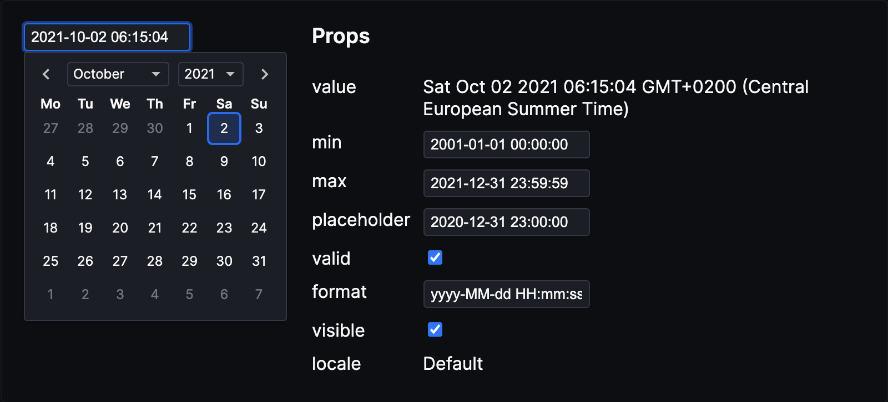

# Date Picker Svelte

[](https://npmjs.com/package/@gregg-cbs/svelte-date-picker)
[](LICENSE)
[](https://npmjs.com/package/@gregg-cbs/svelte-date-picker)
[](https://github.com/coldbrewstudios/svelte-date-picker/actions/workflows/test.yml)

Date and time picker for Svelte

This is an adaptation from [date-picker-svelte](https://www.npmjs.com/package/date-picker-svelte).
* Expanding `closeOnSelection` to be an object so user can choose which actions to close on (day, month, year)
* Expanding `on:change` event to be an object that includes the date and which field was just change (day, month, year)
* Updating `on:change` to fire on every change that happens in the picker (the original version did not fire change on year and month changes)

Goes to original packages demo:   
[Demo](https://date-picker-svelte.kasper.space/demo) • [Documentation](https://date-picker-svelte.kasper.space/docs) • [REPL](https://svelte.dev/repl/044911429c4b4e659362518d9a5deaae?version=4)



## Install

```
npm i @gregg-cbs/svelte-date-picker
```

## Usage

```svelte
<script>
  import { DateInput, DatePicker } from 'date-picker-svelte'

  let date = new Date()

  const minDate = new Date()
  minDate.setFullYear(2020)

  const maxDate = new Date()
  maxDate.setFullYear(2026)

  function onChange(e) {
    date = e.detail.value; // value is always a date
    // e.detail.changed tells you whether day, month or year was changed so you can
    // have side effects on these actions if you want
  }
</script>

<!-- input that shows datepicker when clicked on (wraps the DatePicker for you) -->
<DateInput 
  bind:value={date} 
/>
  
<!-- 
DateInput Props

/** Format string */
format = 'yyyy-MM-dd HH:mm:ss' 

/** Locale object for internationalization */
locale: Locale = {}

/** Whether the date popup is visible */
visible = false

/** Close the date popup when a date is selected */
closeOnSelection: {
  day?: boolean,
  month?: boolean,
  year?: boolean
}

/** Wait with updating the date until a date is selected */
browseWithoutSelecting = false

/** Show a time picker with the specified precision */
timePrecision: 'minute' | 'second' | 'millisecond' | null = null

/** Automatically adjust date popup position to not appear outside the screen */
dynamicPositioning = false
-->

<!-- standalone date picker/calendar so you can do your own thing -->
<DatePicker 
  value={value}
  min={minDate}
  max={maxDate}
  on:change={onChange}
/>

<!-- 
  DatePicker Props

	/** Date value. It's `null` if no date is selected */
	value: Date | null

	/** Show a time picker with the specified precision */
	timePrecision: 'minute' | 'second' | 'millisecond' | null 

	/** The earliest year the user can select */
	min: Date | null

	/** The latest year the user can select */
	max: Date | null

  /** Wait with updating the date until a date is selected */
	browseWithoutSelecting = false

  /** Locale object for internationalization */
  locale: Locale = {}
 -->


<!-- you can also bind value but a note that this will fire a change when the component mounts -->
<DatePicker 
  bind:value={value}
  min={minDate}
  max={maxDate}
/>
```

Check the [docs](https://date-picker-svelte.kasper.space/docs) to learn more

## Contributing

### Get started

1. Install Node.js (v14 works)
2. Run `npm install`

### Commands

- `npm run dev`: Start site in dev mode
- `npm run build`: Build package and site
- `npm run preview`: Preview production site
- `npm run check`: Run `svelte-check`
- `npm run test`: Run tests
- `npm run format`: Format code

### Publish new version

1. Update `CHANGELOG.md`
2. Check for errors
	```
	npm run lint
	```
3. Bump the version number
	```
	npm version --no-git-tag <version>
	```
4. Publish
	```
	npm publish
	```
5. Commit with a tag in format "v#.#.#"
6. Create GitHub release with release notes
